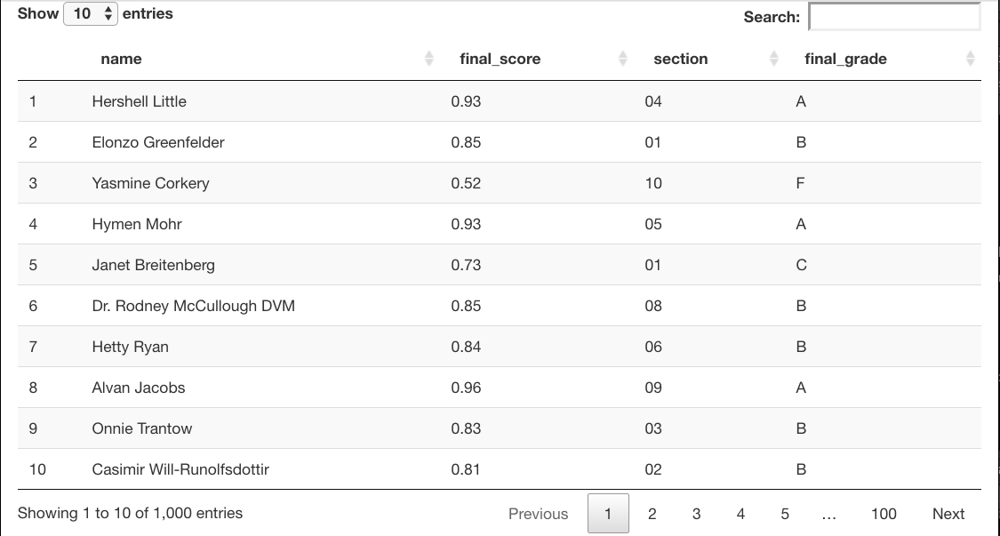
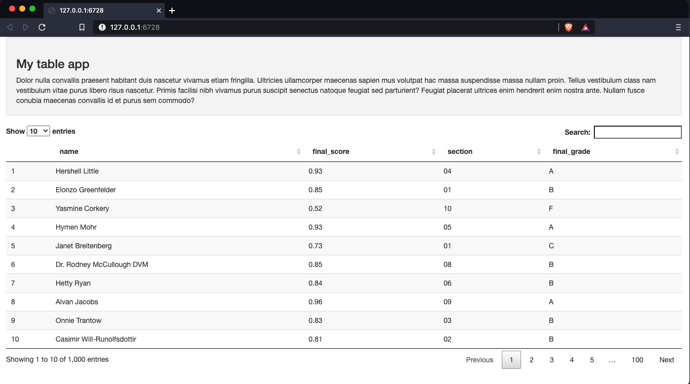
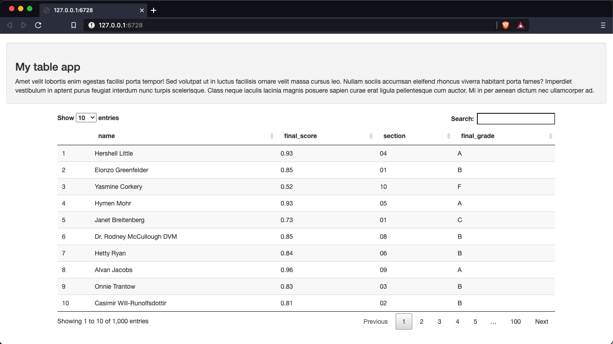
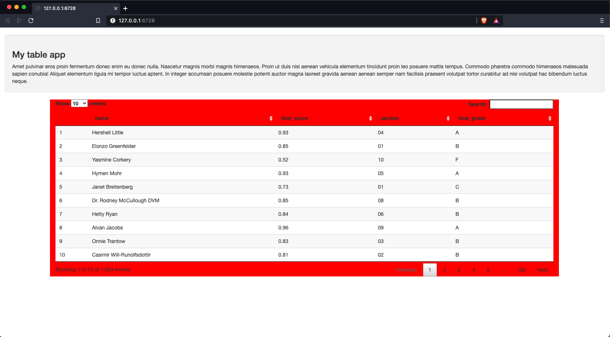
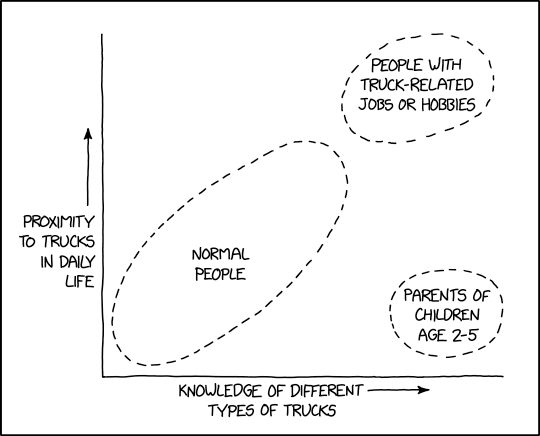
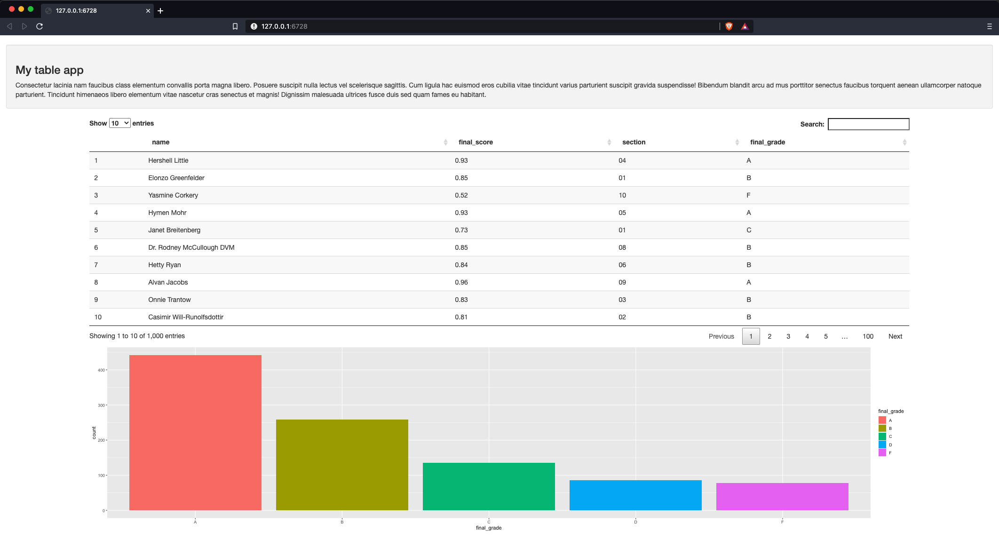

# A table app

Our first app will be a basic app with a table, a graph, and a single drop down selector. To build this we will use the `{DT}` library https://rstudio.github.io/DT/.

## Just a table

Lets start with building a data set to visualize. The data set we are going to build is the grade data for a course with 10 sections. 

```{r message=FALSE, warning=FALSE}
library(tidyverse)
library(charlatan)
library(scales)


grades <- tibble(name = ch_name(1000), 
             final_score = number(rbeta(1000, 5, 1),accuracy = .01),
             section = sample(1:10, 1000, replace = TRUE)) %>% 
  mutate(
    final_grade = case_when(
      final_score <  .60                     ~ 'F',
      final_score >= .60 & final_score < .70 ~ 'D',
      final_score >= .70 & final_score < .80 ~ 'C',
      final_score >= .80 & final_score < .90 ~ 'B',
      final_score >= .90                     ~ 'A'
    )
         ) %>% 
  mutate(section = str_pad(section, 2, 'left', '0'))
```

```{r}
glimpse(grades)
```

The basic framework for a Shiny app looks like this

```{r, eval = FALSE}
library(shiny)

ui <- fluidPage( )

server <- function(input, output, session) { }

shinyApp(ui, server)
```

Let's first just throw a basic data table into the app.
```{r, eval = FALSE}
library(shiny)
library(DT)

ui <- fluidPage(
  DT::dataTableOutput('table')
)

server <- function(input, output, session) {
  output$table <- DT::renderDataTable({
    datatable(grades)
  })
}

shinyApp(ui, server)
```

This gives us an app looking like this.
</br>
</br>


Which is great, but we can a lot better with just a few more lines of code. 

*For the next few steps, I will just include the relevant portions of the app script.*

## Some structure

First we will add a well panel with a nice title and a paragraph that explains what our application does. When I am first building an app, I often fill this space with the `{lorem}` package.

```{r, eval = FALSE}
ui <- fluidPage(
  wellPanel(                                       # New lines
    h3("My table app"),                            # 
    lorem::ipsum(paragraphs = 1, sentences = 6)    #
  ),
  DT::dataTableOutput('table')
)
```

</br>
</br>


Next we are going to center the table. We do this by creating a column call to contain the table. Our column element which contains the table will be 10 wide, and we will offset it by 1.

```{r, eval = FALSE}
ui <- fluidPage(
  wellPanel(
    h3("My table app"),
    lorem::ipsum(paragraphs = 1, sentences = 6)
  ),
  fluidRow(
    column(10, offset = 1, # <==================================================
      DT::dataTableOutput('table')
    )
  )
)
```

</br>
</br>


We can also use custom CSS in the column element.
```{r, eval = FALSE}
ui <- fluidPage(
  br(),
  wellPanel(
    h3("My table app"),
    lorem::ipsum(paragraphs = 1, sentences = 6)
  ),
  fluidRow(
    column(10, offset = 1, style = 'background-color:red', # <==================
      DT::dataTableOutput('table')
    )
  )
)
```

</br>
</br>


## Add a graph!



Next we are going to add a graph to our app. We will make a basic bar graph showing the distribution of grades in the course. Here is the `{ggplot2}` code we will use to make the graph.

```{r, message = FALSE, warning=FALSE}
ggplot(grades, aes(final_grade, fill = final_grade)) + geom_histogram(stat = 'count')
```

The code for the app will look like this
```{r, eval=FALSE}
ui <- fluidPage(
  br(),
  wellPanel(
    h3("My table app"),
    lorem::ipsum(paragraphs = 1, sentences = 6)
  ),
  fluidRow(
    column(10, offset = 1,
      DT::dataTableOutput('table'),
      plotOutput('plot') # <====== Add the plot to the UI, in the column element
    )
  )
)

server <- function(input, output, session) {
  output$table <- DT::renderDataTable({
    datatable(grades)
  })
  
  output$plot <- renderPlot({   # <========== Add new element to the output list
    ggplot(grades, aes(final_grade, fill = final_grade)) + 
      geom_histogram(stat = 'count')
  })
}
```

</br>
</br>


## Add a sidebar and a picker input